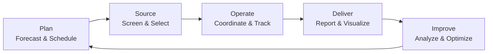

<h1 align="center">M. Mustafa Mirza</h1>

  <b>Supply Chain & Business Analytics Candidate</b> 
  BBA @ IBA Karachi · Data-Driven Operations · Process Coordination · Insight Reporting

  <i>Turning operational data into clear, confident business decisions.</i>

  
  
  

  <a href="#snapshot">Snapshot</a> ·
  <a href="#about">About</a> ·
  <a href="#focus-areas">Focus Areas</a> ·
  <a href="#toolkit">Toolkit</a> ·
  <a href="#experience">Experience</a> ·
  <a href="#research--projects">Research</a> ·
  <a href="#contact">Contact</a>

---

## Snapshot

| | |
|---|---|
| 🎓 **Education** | BBA, Institute of Business Administration (IBA), Karachi · 2023–2027 |
| 🎯 **Target Roles** | Supply Chain Analyst · Operations & Planning · Business / Data Analyst · MIS & Reporting |
| 📊 **Core Strengths** | Data management, Excel analytics, dashboards, process coordination, research |
| 🏢 **Industry Exposure** | Insurance (Adamjee Life), FMCG case research (Colgate), Education (TCF) |
| 📍 **Location** | Karachi, Pakistan |

---

## About

I'm a **BBA student at IBA Karachi** who enjoys the part of business where **clean data meets better decisions**. My hands-on work so far has involved maintaining MIS records, building PivotTables and charts, coordinating schedules across teams, and handling documentation-heavy processes where accuracy matters.

I'm now steering my path toward **supply chain and analytics**, where those same habits (structured data, process discipline, and clear reporting) drive planning, efficiency, and performance.

---

## Focus Areas

| Area | What I bring |
|---|---|
| **Data & MIS Management** | Maintained HR/MIS datasets, kept records accurate and organized for reporting |
| **Reporting & Visualization** | Excel PivotTables and charts, introductory Power BI dashboards |
| **Process Coordination** | Training calendars, multi-stakeholder scheduling, documentation workflows |
| **Criteria-Based Screening** | Shortlisting against defined requirements, a mindset that carries over to vendor and supplier evaluation |
| **Research & Insight** | Qualitative design, thematic analysis, questionnaire design, turning findings into recommendations |
| **Cost & Decision Awareness** | Studied how non-finance teams use management accounting information to decide |

---

## Toolkit

*Click any badge to visit the tool's website.*

**Analytics & Data**

  
  
  

**Workflow & Forms**

  
  

**Exploring Next** *(edit this list to match what you're actually learning)*

  
  

**Competency Map**

| Domain | Skills |
|---|---|
| **Analytics** | PivotTables · Charts · Dashboards · Descriptive analysis · MIS reporting |
| **Operations** | Scheduling · Coordination · Documentation · Process workflows · Settlement processing |
| **Research** | Focus groups · In-depth interviews · Thematic analysis · Questionnaire design |
| **Business** | Management accounting concepts · Organizational behavior · Change management |

---

## Experience

### 🏢 HR Intern, Adamjee Life Assurance Company Ltd.
*Karachi, Pakistan · Jul 15 – Aug 15, 2026*

- **Data & MIS:** Maintained HR/MIS data and used Excel PivotTables and charts to visualize workforce information
- **Coordination:** Planned and coordinated training calendars across teams
- **Screening:** Screened and shortlisted CVs against job requirements and routed candidates to line managers
- **Process Accuracy:** Assisted with Full & Final Settlement (F&F) processing, where precision and documentation are critical
- **Systems Exposure:** Worked with Jotform, EDM, and Decibel, gaining exposure to process automation and system-based workflows
- **Communication:** Corresponded with individuals regarding documentation requirements

### 🎓 Social Intern / Mathematics Instructor, The Citizens Foundation (TCF)
*ADP Program, IBA · Jul – Aug 2023*

- Taught mathematics to underprivileged students preparing for entry tests, building clarity and problem-solving skills
- Developed targeted learning material to address common difficulties
- Organized a campus visit for students to show higher-education pathways

---

## Research & Projects

| Project | Focus | Methods & Takeaway |
|---|---|---|
| **Management Accounting Use by Non-Accounting Professionals** | Adamjee Life & Colgate | How non-finance teams apply financial information to support decisions |
| **Social Media & First-Time Skincare Purchase** | Consumer behavior in Pakistan | Masculinity norms, confidence, and digital persuasion in purchase decisions |
| **Leadership in Action: Gender, EI & Team Dynamics** | Organizational behavior | Industry conversations on leadership style, communication, and adaptability |

*Plus additional case-based assignments involving qualitative analysis and case evaluation.*

---

## Education

**Institute of Business Administration (IBA), Karachi**
Bachelor of Business Administration (BBA) · 2023–2027

`Organizational Behavior` `Human Resource Management` `Leading the Change Process` `Counseling Psychology (in progress)`

---

## Beyond Work

🧊 **Rubik's Cube solving** for focus, pattern recognition, and mental agility
🏊 **Swimming** for endurance, discipline, and clarity

---

## Contact

  <i>Open to internships and entry-level opportunities in supply chain, operations, and analytics.</i>

  
  

